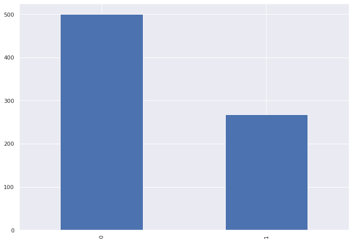

# Classification-Pima-Indians-Diabetes
Logistic Regression Model to explore classification 

# 1. Problem Statement:
	
	The project’s problem statement at the core is to implement a classification algorithm using the provided data “Pima Indians Diabetes Database”. Further the problem is divided into three parts.
	1.  Building a logistic regression algorithm from scratch and evaluating it’s performance.	
	2.  Training a Neural network model with l1 and l2 regularisers and evaluating it’s performance.
	3.  Training a Neural network model along with l1, l2 and drop out and compare the performance.

# 2. Data And Pre-processing:

	Pima Indians Diabetes Database has 768 rows with 8 features. They are 
		1 Glucose (Blood Glucose level)
		2 Pregnancies (The number of pregnancies the patient has had)
		3 Blood Pressure(mm Hg)
		4 Skin Thickness(Triceps skin fold thickness (mm))
		5 Insulin level
		6 BMI (Body Mass Index : weight in kg/(height in m)2)
		7 Diabetes Pedigree Function
		8 Age (In years) .
		9 Outcome ( 0 means non diabetic 1 means diabetic)
	
	The Distribution of the outcome variable is as shown below in the screenshot.

	

As part of pre-processing two major steps were performed.

Standardisation : This is a common but also a very important step in machine learning. Scaling essentially converts the data distribution into a Gaussian with zero mean and unit variance. As the numbers lie in the same range with normal distribution, the model large weight updates in back propagation are eliminated.

Outlier Analysis : Handling and removing outliers also serves as an important steps since the rare and less improbable entries will effect our models prediction. I have used box-cox method to identify and plot the outliers. General assumption is a value above and below 1.5 * IQR is considered to be an outlier. Below plot depicts the same.
	
      	The above plot shows the presence of lot of outliers, but when counted the total was more than 130 rows, which is a bit hard to trust. May be these features do not follow a normal distribution and values above or below IQR are also important entries. Hence, proceeding without removing them.

Data Split: The whole data is split into 3 parts.
Train set( 60 % - 491 rows).
Validation set ( 20 % of 80 % of initial train split - 123 rows ).
Test set ( 20 % - 154 rows ).
	
	All 3 data sets are created using stratification with respect to target. That preserves the ratio of positive and negative outcomes across all 3 data sets.

# 3. Logistic Regression:

3.1 Cross entropy as loss function: Cross entropy is the loss function, whose value we try to reduce in logistic regression, it’s value is given by.

3.2 Sigmoid Function: Using sigmoid to convert the sum of product of weights and features (z) to a probability value in between [1, 0]. Sigmoid function provides various advantages when used like, its value lies between zero and one, it is easily differentiable etc.

3.3 Weight computation and updation: In logistic regression we try to estimate weights(w) and bias(b) of an equation of plane using gradient descent. The sum of products of these weights is then passed to the sigmoid function, which in turn converts this sum to a number between 0 to 1.Now these values are compared against the real target values and a loss is calculated using loss function (cross entropy). Base on the loss value the values of loss and bias are updated with some learning rate.

3.4 Training and Testing: Weights are initialised randomly from a normal distribution. Bias is set to 0.Initially model is trained for 50000 epochs with a learning rate of 0.1.
The loss results are as shown below.

3.5 Learning rate tuning: Keeping all other parameters constant I tried to tune learning rate iteratively. The best learning rate to avoid over fitting will be lr  = 0.01 and epochs will be 10000. Following are the results of the model trained with these parameters.

Although there is no change is results keeping a lower and more stable learning rate will help in further training and never missing the nearest local minima.

3.6 Threshold Optimisation: All the above results are obtained at a constant threshold value of 0.5. But in most of the imbalanced cases the most optimum threshold is not at 0.5, it may be either lower or higher than that. To find optimum threshold I use ROC-AUC curve. Which is a plot of sensitivity vs 1-specificity, the left top most point’s threshold where true positive rate is more and false positive rate is less becomes my optimum threshold.

According to ROC - AUC curve the AUC score is 0.83, which tells the performance of model across all thresholds. And Best threshold is 0.32. The below results are obtained using the best threshold.

Although the overall accuracy with best threshold is 77 % which is lesser than the normal 0.5 thresholds score of 80%. But this model is more usable since precision and recall scores are more reasonable.

# 4. Neural Network classification:

Neural networks are class of models which were developed to best mimic the human thought process and perform a task with almost human level efficiency.

It has 5 major components namely weights, activation function, forward propagation, backward propagation, loss function. Weights signify how strong or weak a connection is, activation functions adds non linearity to these weights to learn non-linearity in the data,  forward pass is when these weights are updated according to the features values, in back propagation the weights are updated on the basis of target values and predicted values. Loss function is the aggregated value which has to be reduced to get the optimum weights.

Generally a neural network for binary classification uses binary cross entropy as loss function and sigmoid as activation function in the last layer. Both of these are same as explained in logistic regression part.

Using the same data to train a neural network without any regularisation or dropout. The below are the results.

The validation and Train accuracy are diverging as we train the model. 

Validation loss and Train loss are also diverging as we increase epochs. This shows that the model is overfitting.

# Regularisation:

Regularisation is a method used to reduce overfitting. There are 2 types of Regularisations L1(Lasso) and L2(Ridge). In both these methods we add an extra term to the loss function, which has to be reduced. This loss function penalises the over use or high co-efficient of the weights. In doing so, we avoid overfitting of the model.

Below are the results with L1 regularisation.

Here the validation loss and train loss both are getting reduced.

The accuracy values also increase steadily for both train and validation.

Hence we can say this is a more stable model.

Applying L2 regularisation also gave curves which are diverging as the epochs increase.But still the plots are better than using Neural networks without regularisation.

Drop Out : Drop Out is the concept of turning of x% of neurons off randomly. In Keras it can be simply done by adding a drop out layer after a hidden layer. By doing so we allow the model to ignore the weighted sums randomly and avoid overfitting by seeing repeated features.

The results of Drop out plus l1 regularisation are as follows:

These accuracy and loss values of train and validation are more streamlined and move together. Hence, this model is better than all other neural network models seen before.

Classification Report shows decent accuracy and F1 scores across all three splits.

	

Optimising Threshold: Using AUC- ROC the best threshold found here is 0.335.Below are the results of the same. With Auc 0.83.

As Discussed earlier, although the overall accuracy is lesser than 0.5 as threshold’s score.

The Precision and Recall values are fairly acceptable, which makes this model more usable.

